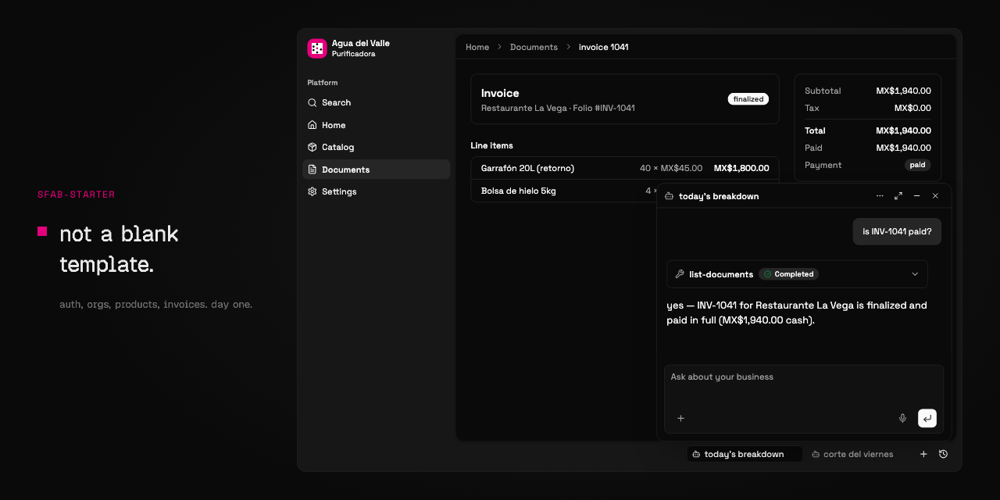

# SFab Starter

An AI-native app foundation: every app you build on it ships with an AI agent
that works on your own data and business context. It is a complete Cloudflare
full-stack monorepo you can clone and run.



**Copy → ask → reshape.** The usual path is clone, run it, then (often with an
AI agent) turn the neutral hub into *your* product. For that first pass, see
[`docs/template-init.md`](docs/template-init.md) — suggested questions and a
light plan → transform path. Day-to-day agent conventions live in
[`AGENTS.md`](AGENTS.md).

## Getting started

**Prerequisites:** Node 20+ and pnpm 11+ (this repo pins
`packageManager: pnpm@11.5.2`). If needed: `corepack enable`.

Clone (or click **Use this template** on GitHub):

```bash
git clone https://github.com/sfab-oss/sfab-starter.git
cd sfab-starter
pnpm install

# Configure local env
cp apps/web/.dev.vars.example apps/web/.dev.vars
# Fill in apps/web/.dev.vars — the file documents each var.
# BETTER_AUTH_SECRET: at least 32 characters, e.g.
#   openssl rand -base64 32
# AI_GATEWAY_API_KEY: required for the org agent chat (Vercel AI Gateway —
#   https://vercel.com/docs/ai-gateway). Sign-in works without it; chat does not.
# Other providers: see docs/guides/org-agent-inference-providers.md

# Set up the local database
pnpm db:migrate

# Seed a demo user + organization (recommended for the path below)
pnpm db:seed

# Run it
pnpm dev
```

Open http://localhost:4011. After seeding, sign in with:

| Field | Value |
|-------|-------|
| **Email** | `demo@sfab.dev` |
| **Password** | `demo1234` |

Or skip seed and create an account at `/signup`.

`pnpm db:seed` is idempotent and **local-only** — safe to re-run, and it never
touches a remote/production database.

To deploy: `pnpm build`, then `wrangler deploy` from `apps/web` (set Worker
secrets with `wrangler secret put`, and migrate the remote D1 database before
serving traffic).

## What's included

A real, working app, not a blank page. Run it and you get:

- **Authentication and organizations** (Better Auth with the organization
  plugin): sign-in, multi-tenant orgs, and org-scoped access wired through every
  layer.
- **A built-in AI agent** (the `agent` package): a durable, per-organization
  agent with chat that works from your data and business context. This is the
  AI-native part, and it is foundation rather than a demo. It is the kind of
  thing you keep when building, say, an ERP that comes with its own agent.
- **An end-to-end type-safe stack** with no code generation, from the database to
  the UI.

These are patterns to keep and make your own. Remove what you do not need, but the
wired-up auth, org-scoping, and agent are the point of the starter. See the worked
example in [`docs/architecture.md`](docs/architecture.md) for how a feature flows
through the layers.

## Stack

| Layer | Technology |
|-------|-----------|
| **Framework** | [TanStack Start](https://tanstack.com/start) (full-stack React) |
| **API** | [Hono](https://hono.dev/) RPC, type-safe from route to client |
| **Database** | [Drizzle ORM](https://orm.drizzle.team/) + [Cloudflare D1](https://developers.cloudflare.com/d1/) |
| **Auth** | [Better Auth](https://www.better-auth.com/) with the organization plugin |
| **AI** | a built-in org agent on the [Vercel AI SDK](https://sdk.vercel.ai/) (streaming, tools) |
| **UI** | [shadcn/ui](https://ui.shadcn.com/) + [Base UI](https://base-ui.com/) + [Tailwind CSS v4](https://tailwindcss.com/) |
| **Email** | [Resend](https://resend.com/) + [React Email](https://react.email/) |
| **Tooling** | Turbo, pnpm, Biome, TypeScript |
| **Deployment** | Cloudflare Workers via Wrangler |

## The base contract

The starter ships a **country-neutral transaction hub** — not a vertical demo.
Catalog (products) and Documents (quotes, orders, invoices) work end-to-end:
create a product, draft an invoice, add lines, finalize to draw a folio and freeze
the totals, then record a payment against the balance due. This is the base; you
build your domain on top of it.

**What ships in the base:**

- **Catalog** — products with integer-minor-unit pricing (the money convention;
  see `packages/core/src/money.ts`).
- **Documents** — draft → finalize with folio-atomic sequences, an activity log,
  and pack seams. Design:
  [`docs/architecture/transaction-core.md`](docs/architecture/transaction-core.md).
- **Pay-on-document** — record payments on finalized invoices and bills; payment
  status shows on the documents list and detail.
- **The AI agent** — can read catalog, documents, and activity, and can
  create/update products. Money and document mutations stay on the UI by
  convention.

**What the base deliberately leaves out** (packs or follow-on work; do not edit
the hub to add them):

- A dedicated wallet / payments hub UI — settlement and customer credit live in
  core/API; operator surfaces stay document- and entity-centric.
- Inventory / GL posting — the `shouldAffectStock` gate and `afterCommit` seam
  are in place; the handler is pack-owned.

New projects clone, `pnpm install`, run migrations, and have a working neutral
app — nothing to delete before building a domain on top.

## Project layout

A layer-sliced monorepo: one app in `apps/web`, with capabilities split
into packages (`core`, `db`, `auth`, `agent`, `ui`, and more). Find one slice
and you know where the rest live. The full map, the feature-key model, and a
worked example are in [`docs/architecture.md`](docs/architecture.md).

## Where to go next

- [`docs/template-init.md`](docs/template-init.md): adopting / transforming the template (agent-oriented guidance).
- [`AGENTS.md`](AGENTS.md): commands + conventions once you are working in the repo.
- [`docs/architecture.md`](docs/architecture.md): the layer map and a worked feature example.
- [`docs/guides/`](docs/guides/): code-anchored how-tos.
- [`docs/decisions/`](docs/decisions/): the architecture decision records.

## License

[MIT](LICENSE).
