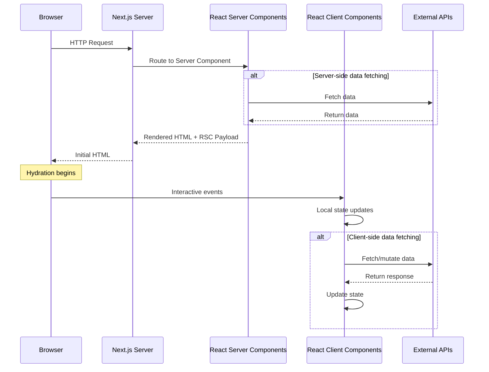
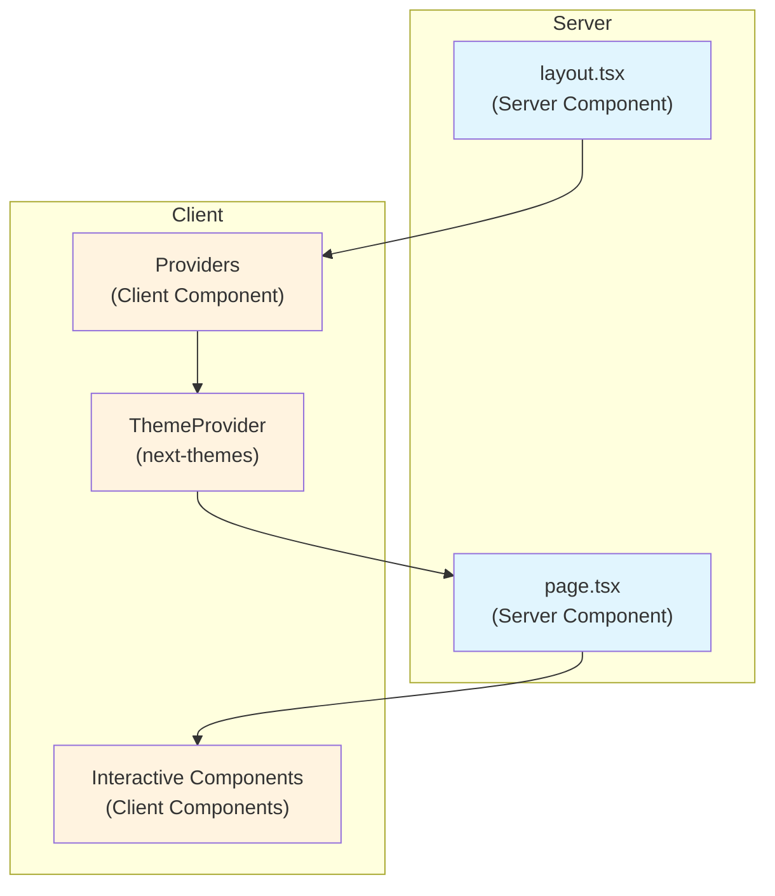
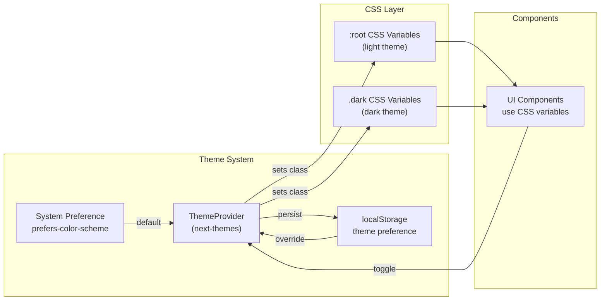
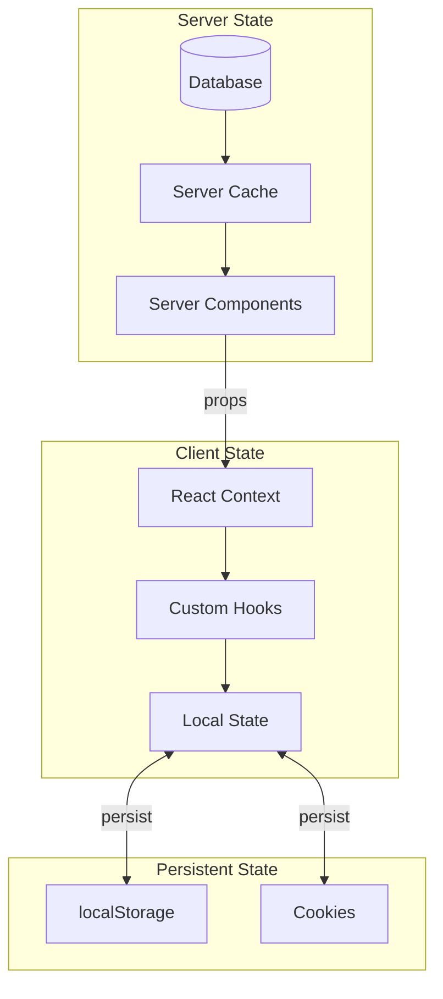
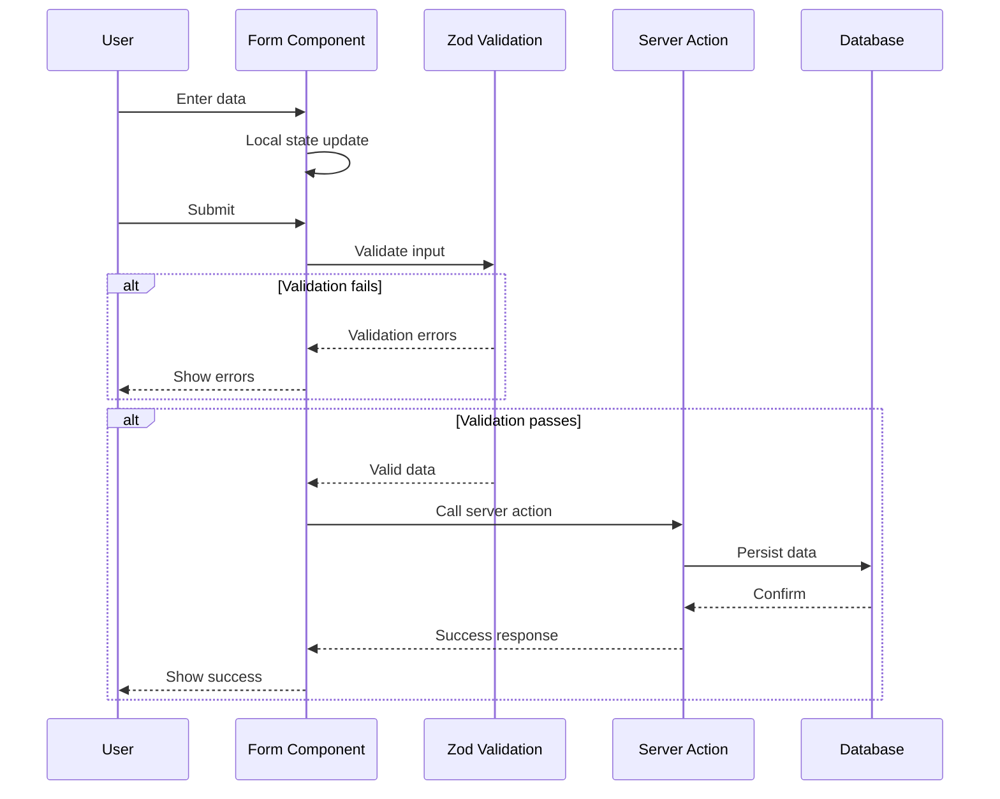
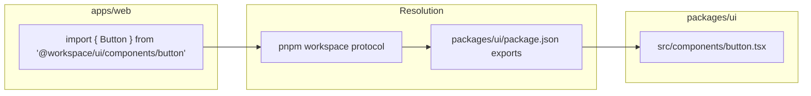
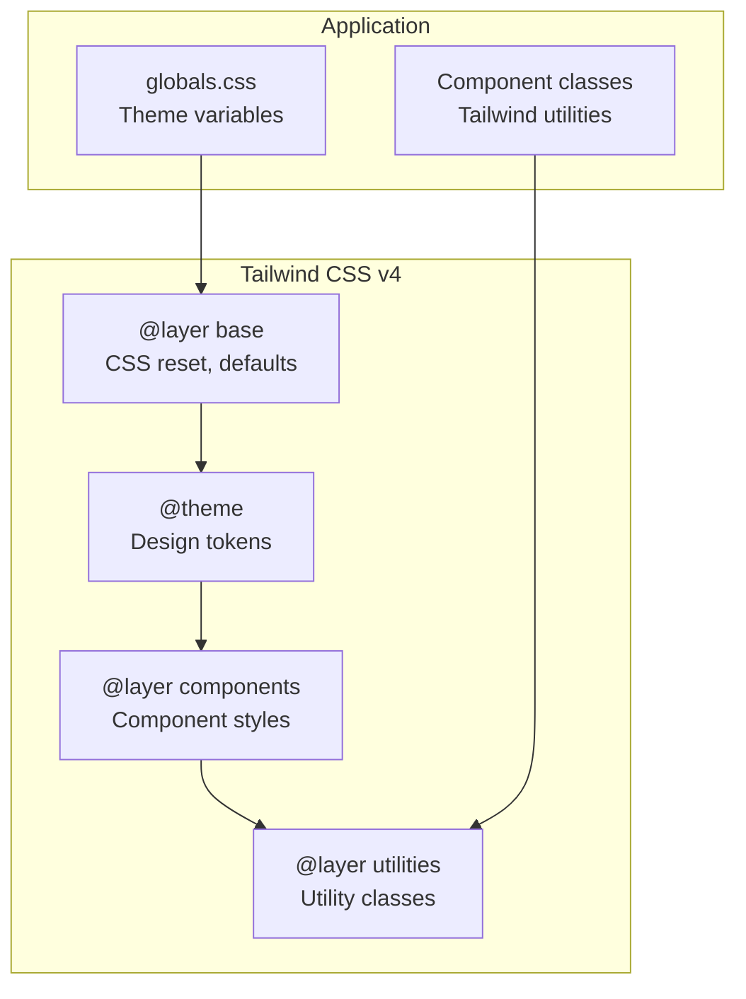

# Data Flow Diagram

This document illustrates how data flows through the application.

## Request/Response Flow

## Component Rendering Flow

## Theme Data Flow

## State Management Patterns

## Form Data Flow

## Import Resolution Flow

## CSS Cascade

