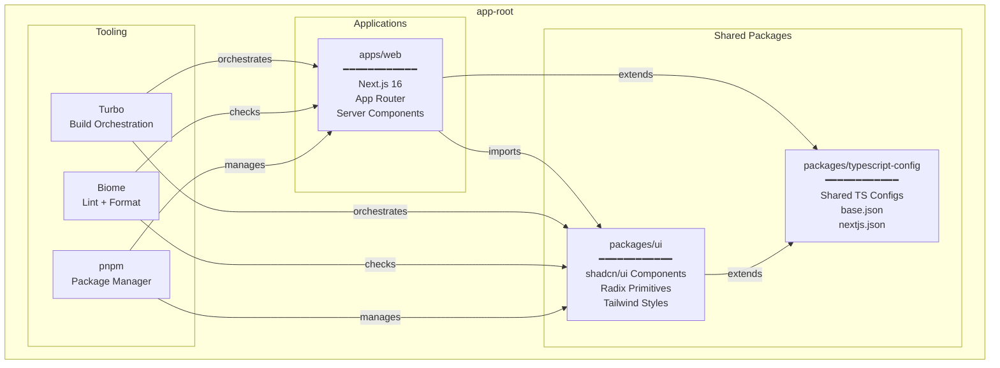
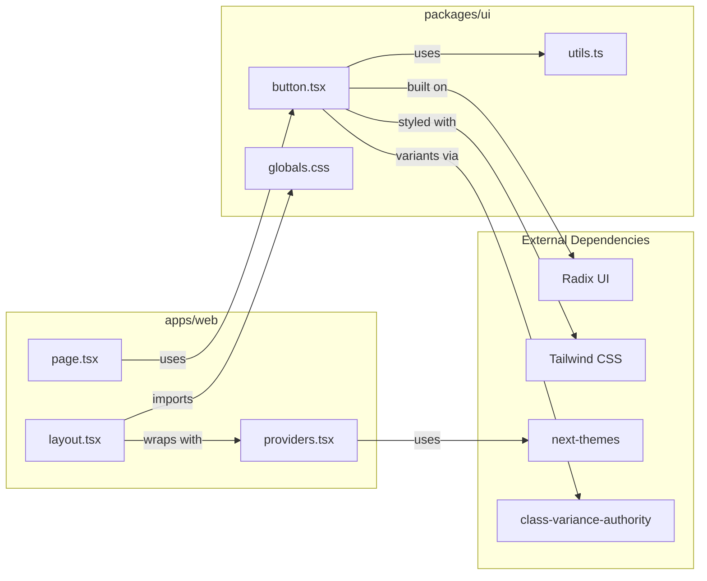
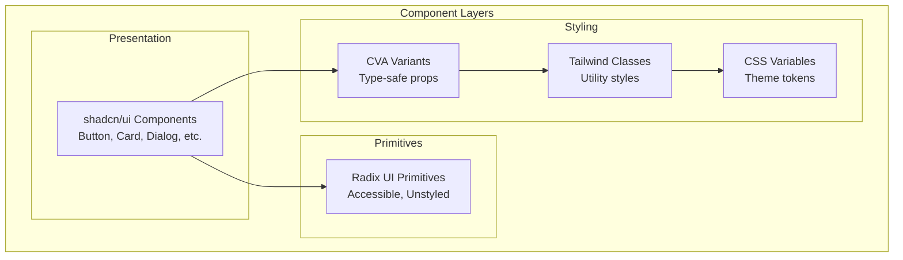
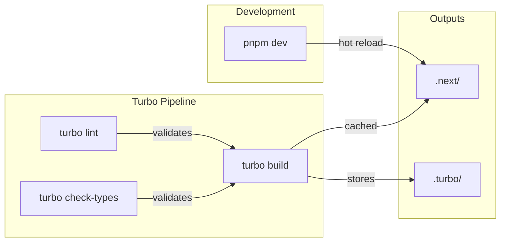
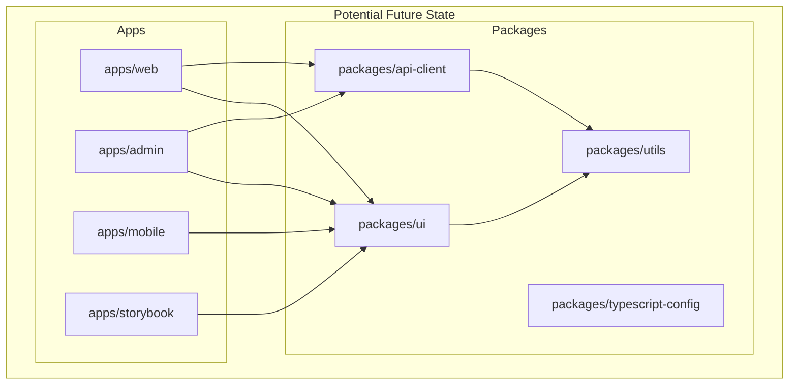

# System Overview Diagram

This document provides visual representations of the system architecture.

## Monorepo Structure

## Package Dependencies

## Component Architecture

## Build Pipeline

## Future Growth

As the project grows, additional apps and packages can be added:

