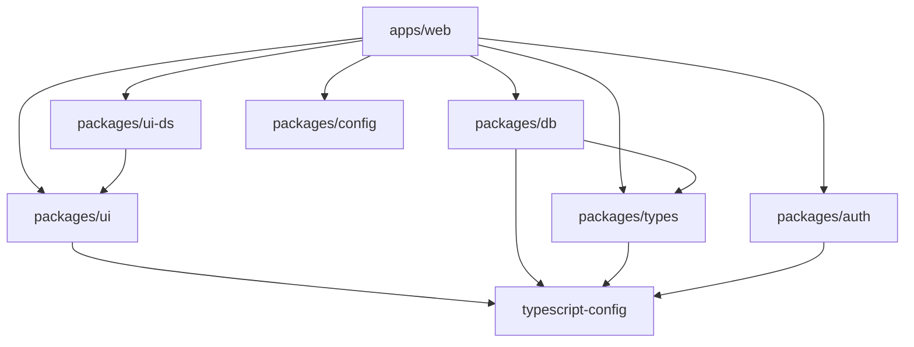

# Folder Structure

This document details the organization of the codebase.

## Root Structure

```
project-root/
├── apps/                    # Deployable applications
├── packages/                # Shared libraries
├── docs/                    # Documentation (this folder)
├── .claude/                 # AI assistant configuration
├── .turbo/                  # Turbo cache (gitignored)
├── .vscode/                 # VS Code workspace settings
├── biome.jsonc              # Biome linting/formatting config
├── turbo.json               # Turbo monorepo configuration
├── pnpm-workspace.yaml      # pnpm workspace definition
├── package.json             # Root package manifest
├── tsconfig.json            # Root TypeScript config
├── docker-compose.yml       # PostgreSQL container
└── README.md                # Project README
```

## Apps Directory

Applications that are built and deployed independently.

### apps/web

The main Next.js web application with Hono API server.

```
apps/web/
├── app/                     # Next.js App Router
│   ├── (auth)/              # Authentication pages (login, signup)
│   ├── (protected)/         # Protected pages requiring auth
│   │   ├── (dashboard)/     # Dashboard home
│   │   ├── chat/            # AI chat interface
│   │   └── inventory/       # Inventory management
│   ├── design-system/       # Component showcase
│   ├── layout.tsx           # Root layout with providers
│   └── page.tsx             # Landing page
├── server/                  # Hono API server
│   ├── routes/              # API route definitions
│   │   ├── protected/       # Auth-required routes
│   │   │   ├── chat.ts      # Chat endpoints
│   │   │   └── index.ts     # Protected route aggregator
│   │   └── public/          # Public routes
│   │       ├── status.ts    # Health check
│   │       ├── contact.ts   # Contact form
│   │       └── index.ts     # Public route aggregator
│   ├── middleware/          # Hono middleware
│   │   └── auth.ts          # Authentication middleware
│   └── index.ts             # Main Hono app setup
├── components/              # App-specific components
│   ├── chat/                # Chat UI components
│   ├── dashboard/           # Dashboard widgets
│   ├── layout/              # Layout components
│   ├── providers/           # Context providers
│   └── common/              # Shared app components
├── hooks/                   # App-specific React hooks
│   └── query/               # React Query hooks
│       ├── use-products.ts  # Product queries & mutations
│       ├── use-warehouses.ts
│       └── use-chats.ts
├── lib/                     # App-specific utilities
│   ├── ai/                  # AI integration
│   │   ├── agents/          # AI agents
│   │   └── title-generator.ts
│   ├── api-client.ts        # Hono RPC client
│   ├── env.ts               # Environment variable validation
│   └── utils.ts             # Utility functions
├── types/                   # App-specific types
│   └── ai.ts                # AI-related types
├── public/                  # Static assets
├── next.config.mjs          # Next.js configuration
├── postcss.config.mjs       # PostCSS configuration
├── tsconfig.json            # TypeScript config (extends shared)
└── package.json             # Package manifest
```

**Key conventions:**

- `app/` uses Next.js App Router with route groups
- `(protected)` routes require authentication
- `server/` contains the Hono API server
- `components/` for app-specific components only
- `hooks/query/` for all React Query data fetching
- Shared components belong in `packages/ui`

## Packages Directory

Shared code consumed by apps and potentially other packages.

### packages/db

Database schema, migrations, and service layer using Drizzle ORM.

```
packages/db/
├── drizzle/                 # Migration files
├── src/
│   ├── schema/              # Drizzle table definitions
│   │   ├── auth.ts          # User & session tables
│   │   ├── chat.ts          # Chat & messages tables
│   │   ├── products.ts      # Product & movement tables
│   │   ├── warehouses.ts    # Warehouse tables
│   │   └── index.ts         # Schema aggregator
│   ├── services/            # Business logic & queries
│   │   ├── chat.ts          # Chat CRUD operations
│   │   ├── products.ts      # Product management
│   │   ├── warehouses.ts    # Warehouse operations
│   │   └── search.ts        # Global search
│   ├── types/               # Database-specific types
│   │   └── chat.ts          # Chat type definitions
│   ├── lib/                 # Database utilities
│   │   └── chat-utils.ts    # Chat helper functions
│   ├── client.ts            # Drizzle client setup
│   ├── env.ts               # DB environment variables
│   └── seed.ts              # Database seeding script
├── drizzle.config.ts        # Drizzle Kit configuration
├── package.json             # Package manifest with exports
└── tsconfig.json            # TypeScript config
```

**Export structure:**
- `@workspace/db/client` - Drizzle client instance
- `@workspace/db/schema` - All table definitions
- `@workspace/db/services/*` - Service functions
- `@workspace/db/types/*` - Type definitions

### packages/types

Shared TypeScript types and Zod schemas.

```
packages/types/
├── src/
│   ├── hono.ts              # Hono context types
│   ├── products.ts          # Product schemas & types
│   ├── warehouses.ts        # Warehouse schemas & types
│   └── index.ts             # Type aggregator
├── package.json             # Package manifest
└── tsconfig.json            # TypeScript config
```

**Purpose:**
- Shared Zod schemas for validation
- TypeScript types used across packages
- API request/response types
- No runtime logic, pure types

### packages/auth

Authentication configuration using Better Auth.

```
packages/auth/
├── src/
│   ├── index.ts             # Better Auth setup
│   └── env.ts               # Auth environment variables
├── package.json             # Package manifest
└── tsconfig.json            # TypeScript config
```

**Purpose:**
- Centralized auth configuration
- Session management setup
- Auth providers configuration

### packages/ui

Shared UI component library built with shadcn/ui.

```
packages/ui/
├── src/
│   ├── components/          # React components
│   │   ├── shadcn/          # shadcn/ui components
│   │   │   ├── button.tsx
│   │   │   ├── card.tsx
│   │   │   └── ...
│   │   └── brand/           # Custom app components
│   │       ├── app-layout.tsx
│   │       ├── app-breadcrumbs.tsx
│   │       └── ...
│   ├── hooks/               # Shared React hooks
│   ├── lib/                 # Utility functions
│   │   └── utils.ts         # cn() class merging utility
│   └── styles/              # Global styles
│       └── globals.css      # Tailwind + theme tokens
├── postcss.config.mjs       # PostCSS config for the package
├── package.json             # Package manifest with exports
└── tsconfig.json            # TypeScript config
```

**Export structure:**
- `@workspace/ui/components/*` - All UI components
- `@workspace/ui/hooks/*` - Shared React hooks
- `@workspace/ui/lib/*` - Utility functions
- `@workspace/ui/globals.css` - Global styles

### packages/ui-ds

Design system registry and documentation.

```
packages/ui-ds/
├── src/
│   ├── registry/            # Component registry
│   │   └── registry.ts      # Component metadata
│   └── ...
├── package.json             # Package manifest
└── tsconfig.json            # TypeScript config
```

**Purpose:**
- Component documentation
- Design system browsing
- Component examples and demos

### packages/config

Shared configuration values.

```
packages/config/
├── src/
│   └── index.ts             # Shared constants (BASE_URL, etc.)
├── package.json             # Package manifest
└── tsconfig.json            # TypeScript config
```

### packages/typescript-config

Shared TypeScript configurations.

```
packages/typescript-config/
├── base.json                # Base strict configuration
├── nextjs.json              # Next.js-specific config
├── react-library.json       # React library config
└── package.json             # Package manifest
```

## Configuration Files

| File | Purpose |
|------|---------|
| `biome.jsonc` | Linting and formatting rules (extends Ultracite) |
| `turbo.json` | Task orchestration and caching |
| `pnpm-workspace.yaml` | Defines workspace packages |
| `docker-compose.yml` | PostgreSQL container configuration |
| `.vscode/settings.json` | Editor settings for consistency |

## Adding New Packages

1. Create directory in `apps/` or `packages/`
2. Add `package.json` with appropriate name (`@workspace/name` convention)
3. Add `tsconfig.json` extending shared config
4. Define exports in `package.json` for consumable modules
5. Update consuming packages to add dependency

## Adding New Apps

1. Create directory in `apps/`
2. Set up framework-specific configuration
3. Import shared packages as needed
4. Add to Turbo pipeline if custom tasks needed

## Package Dependencies



