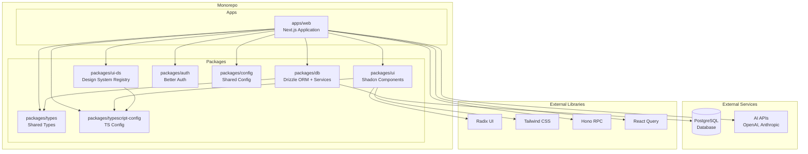
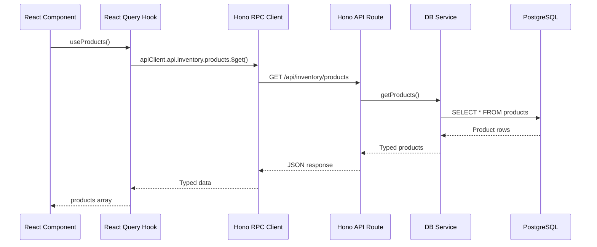
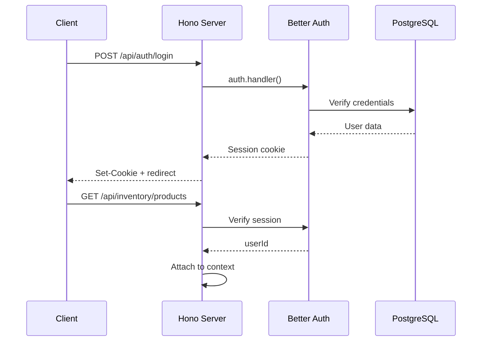

# Architecture Overview

This document provides a high-level view of the architecture and how all the pieces fit together.

## System Context

This is a **full-stack monorepo** designed for building modern, type-safe web applications with end-to-end type safety, client-side data fetching, and AI capabilities. It provides a complete foundation for scalable, type-safe, and accessible web development.



## Core Design Principles

### 1. End-to-End Type Safety

The entire stack is designed for complete type safety from database to UI:

- **Database** - Drizzle ORM with TypeScript-first schema definitions
- **API** - Hono RPC provides type-safe API routes with automatic type inference
- **Client** - React Query hooks with full TypeScript support
- **Validation** - Zod schemas for runtime validation at API boundaries

**Type flow example:**
```
DB Schema (Drizzle) → Service Layer → Hono Route → RPC Client → React Query Hook → UI Component
```

### 2. Client-Side Data Fetching

Unlike traditional Next.js patterns with server-side data fetching, this architecture uses **client-side fetching with React Query**:

- **React Query** manages all data fetching, caching, and synchronization
- **Hono RPC client** provides type-safe API calls
- **Better UX** with optimistic updates, background refetching, and granular loading states
- **Flexible** - easy to invalidate and refetch specific queries

**Why client-side?**
- More interactive and dynamic UIs
- Better control over loading and error states
- Optimistic updates for instant feedback
- Automatic background refetching
- Works seamlessly with streaming AI responses

### 3. Separation of Concerns

The monorepo separates code into distinct layers:

- **Apps** - Next.js application with UI and routing
- **Packages** - Modular, reusable libraries:
  - `db` - Database schema, migrations, and service layer
  - `types` - Shared TypeScript types and Zod schemas
  - `auth` - Authentication configuration
  - `ui` - Shared UI components (shadcn/ui)
  - `ui-ds` - Design system registry and documentation
  - `config` - Shared configuration

### 4. Component-Driven Development

UI development follows modern React patterns:

- **shadcn/ui** components copied into the codebase for full control
- **Design system registry** for browsing and documenting components
- Built on accessible **Radix UI** primitives
- **Type-safe variants** via Class Variance Authority (CVA)
- **Tailwind CSS v4** with OKLch color system

### 5. Service Layer Architecture

Clear separation between data access and business logic:

- **Schema** - Drizzle table definitions in `packages/db/src/schema/`
- **Services** - Business logic and queries in `packages/db/src/services/`
- **API Routes** - Thin Hono route handlers in `apps/web/server/routes/`
- **Hooks** - React Query hooks for data fetching in `apps/web/hooks/query/`

### 6. Type-Safe Environment Variables

Environment variables are validated at runtime using **@t3-oss/env**:

- Each package defines its own env schema
- Build fails if required env vars are missing
- Full TypeScript autocomplete for env vars
- Centralized `.env` file at monorepo root

## Architectural Boundaries

| Boundary | Rule |
|----------|------|
| `apps/web` | Can import from all `packages/*` |
| `packages/db` | Can import `@workspace/types` only |
| `packages/types` | Pure types and schemas, no business logic |
| `packages/ui` | Cannot import from `apps/*` or domain packages |
| `packages/ui-ds` | Can import from `@workspace/ui` |
| `packages/auth` | Standalone auth configuration |
| `packages/typescript-config` | Pure configuration, no runtime code |

## Data Flow Architecture

### Client-Side Fetching Flow



### Authentication Flow



## Key Technologies

| Layer | Technology | Purpose |
|-------|-----------|---------|
| **Frontend** | Next.js 16, React 19 | UI framework with App Router |
| **API** | Hono | Type-safe, lightweight API framework |
| **Data Fetching** | React Query | Client-side data fetching and caching |
| **Database** | Drizzle ORM | Type-safe database queries |
| **Auth** | Better Auth | Authentication and session management |
| **Validation** | Zod | Runtime type validation |
| **Styling** | Tailwind CSS v4 | Utility-first CSS |
| **Components** | shadcn/ui, Radix UI | Accessible component primitives |
| **AI** | Vercel AI SDK | Streaming AI responses |

## Key Architectural Decisions

See the [decisions/](../decisions/) directory for Architecture Decision Records (ADRs) explaining why specific choices were made.

## Related Documents

- [Folder Structure](./folder-structure.md) - Detailed directory organization
- [Tech Stack](./tech-stack.md) - Technology choices and rationale
- [Data Fetching Guide](../guides/data-fetching.md) - How to fetch and mutate data
- [System Diagram](./diagrams/system-overview.md) - Visual architecture
