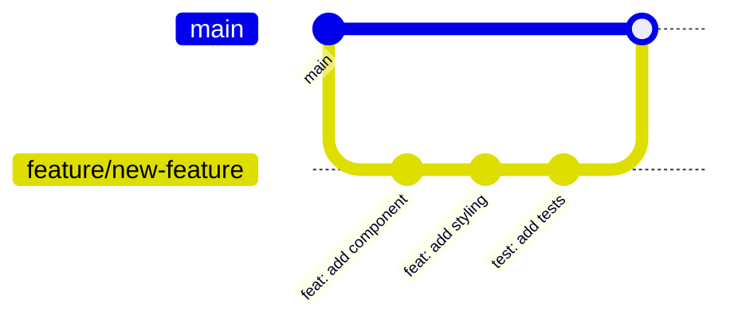
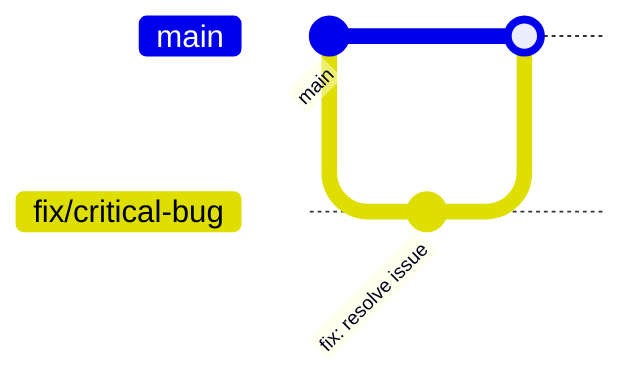

# Git Workflow

This document describes Git practices for this project.

## Branch Naming

### Format

```
<type>/<short-description>
```

### Types

| Type | Purpose | Example |
|------|---------|---------|
| `feature` | New features | `feature/user-authentication` |
| `fix` | Bug fixes | `fix/login-redirect-loop` |
| `refactor` | Code restructuring | `refactor/extract-api-client` |
| `docs` | Documentation | `docs/add-deployment-guide` |
| `chore` | Maintenance | `chore/update-dependencies` |
| `test` | Test additions | `test/add-auth-tests` |

### Examples

```bash
feature/add-dark-mode
feature/user-profile-page
fix/button-hover-state
fix/form-validation-error
refactor/simplify-auth-flow
docs/api-reference
chore/bump-next-version
```

## Commit Messages

### Format

```
<type>: <description>

[optional body]

[optional footer]
```

### Types

Same as branch types: `feat`, `fix`, `refactor`, `docs`, `chore`, `test`

### Examples

```bash
feat: add dark mode toggle to header

fix: resolve infinite redirect on login page

refactor: extract API client into separate module

docs: add getting started guide

chore: update dependencies to latest versions

test: add unit tests for auth utilities
```

### Guidelines

1. **Use imperative mood**: "add feature" not "added feature"
2. **Keep first line under 72 characters**
3. **Don't end with a period**
4. **Capitalize first letter**
5. **Reference issues when applicable**: `fix: resolve login bug (#123)`

### Commit Body

For complex changes, add a body explaining why:

```
refactor: restructure component directory

Move shared components to packages/ui to enable reuse across
multiple applications. This change supports the upcoming admin
dashboard that will share UI components with the main app.

Relates to #456
```

## Pull Requests

### Title Format

Same as commit messages:

```
feat: add user authentication flow
fix: resolve race condition in data fetching
```

### Description Template

```markdown
## Summary

Brief description of what this PR does.

## Changes

- Change 1
- Change 2
- Change 3

## Testing

How was this tested?

## Screenshots (if applicable)

## Checklist

- [ ] Tests added/updated
- [ ] Documentation updated
- [ ] Types are correct
- [ ] No console.log statements
```

### PR Size

- Keep PRs focused and reviewable
- Aim for under 400 lines of changes
- Split large features into smaller PRs

## Workflow

### Feature Development



1. Create branch from `main`
2. Make commits following conventions
3. Push and create PR
4. Get review and address feedback
5. Merge to `main`

### Hotfix



1. Create branch from `main`
2. Fix the issue
3. Create PR with expedited review
4. Merge to `main`

## Common Git Commands

### Starting Work

```bash
# Update main
git checkout main
git pull origin main

# Create feature branch
git checkout -b feature/my-feature
```

### During Development

```bash
# Stage changes
git add .

# Commit
git commit -m "feat: add new component"

# Push branch
git push -u origin feature/my-feature
```

### Keeping Up to Date

```bash
# Update your branch with main
git checkout main
git pull origin main
git checkout feature/my-feature
git rebase main

# Or merge (creates merge commit)
git merge main
```

### After PR Approval

```bash
# Squash and merge via GitHub UI (preferred)
# Or locally:
git checkout main
git merge --squash feature/my-feature
git commit -m "feat: complete feature description"
git push origin main
```

## Pre-commit Hooks

Husky runs checks before commits:

1. **Biome formatting** - Code is formatted correctly
2. **Linting** - No lint errors

If a commit fails:

```bash
# Fix issues
pnpm lint:fix

# Try commit again
git commit -m "your message"
```

### Bypassing Hooks (Emergency Only)

```bash
git commit --no-verify -m "emergency fix"
```

Use sparingly and fix issues in a follow-up commit.

## Protected Branches

### main

- Requires PR review
- Must pass CI checks
- No direct pushes

## Release Process

(Customize based on your deployment strategy)

### Semantic Versioning

```
MAJOR.MINOR.PATCH

1.0.0 -> 1.0.1 (patch: bug fix)
1.0.1 -> 1.1.0 (minor: new feature)
1.1.0 -> 2.0.0 (major: breaking change)
```

### Creating a Release

```bash
# Tag the release
git tag -a v1.0.0 -m "Release version 1.0.0"
git push origin v1.0.0
```

## Troubleshooting

### Undo Last Commit (Not Pushed)

```bash
git reset --soft HEAD~1
```

### Discard Local Changes

```bash
# Specific file
git checkout -- path/to/file

# All changes
git checkout -- .
```

### Fix Commit Message

```bash
# Last commit only, not pushed
git commit --amend -m "corrected message"
```

### Resolve Merge Conflicts

1. Open conflicted files
2. Look for `<<<<<<<`, `=======`, `>>>>>>>`
3. Choose correct code and remove markers
4. Stage resolved files: `git add .`
5. Continue: `git rebase --continue` or `git merge --continue`
