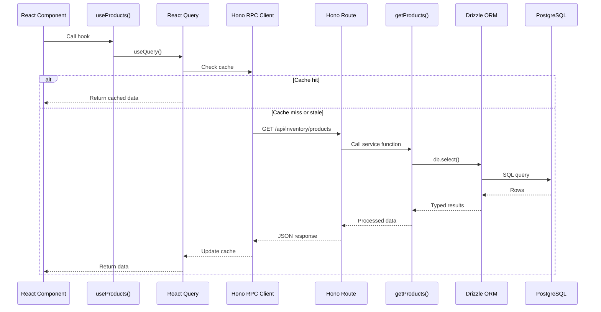

# Data Fetching Guide

This guide covers how to fetch and mutate data in this application using React Query and Hono RPC.

## Architecture Overview

This application uses **client-side data fetching** instead of traditional Next.js server-side patterns. Here's why and how:

### Why Client-Side?

- **Better UX** - Optimistic updates, background refetching, granular loading states
- **Interactive UIs** - Works seamlessly with real-time features like AI chat
- **Better control** - Easier cache invalidation and state synchronization
- **Type-safe** - End-to-end type safety from database to UI

### The Stack

1. **Drizzle ORM** - Type-safe database queries
2. **Service Layer** - Business logic in `packages/db/src/services/`
3. **Hono API** - Type-safe API routes in `apps/web/server/routes/`
4. **Hono RPC Client** - Type-safe API calls
5. **React Query** - Client-side data fetching and caching
6. **Custom Hooks** - Reusable data hooks

## Full Data Flow



## Step-by-Step Flow

### 1. Define Database Schema

**Location:** `packages/db/src/schema/products.ts`

```typescript
import { pgTable, text, integer } from "drizzle-orm/pg-core";

export const products = pgTable("products", {
  id: text("id").primaryKey(),
  name: text("name").notNull(),
  sku: text("sku").notNull().unique(),
  price: text("price"),
  totalStock: integer("total_stock").notNull().default(0),
  createdAt: text("created_at").notNull(),
  updatedAt: text("updated_at").notNull(),
});
```

### 2. Create Service Function

**Location:** `packages/db/src/services/products.ts`

```typescript
import { db } from "../client";
import { products } from "../schema";

export async function getProducts() {
  return await db.select().from(products);
}

export async function getProductById(id: string) {
  const [product] = await db
    .select()
    .from(products)
    .where(eq(products.id, id));
  
  return product;
}
```

**Key points:**
- Service functions handle all database operations
- Return type is inferred from Drizzle schema
- Reusable across different API routes
- Easy to test in isolation

### 3. Define Zod Schema (for mutations)

**Location:** `packages/types/src/products.ts`

```typescript
import { z } from "zod";

export const createProductSchema = z.object({
  name: z.string().min(1, "Name is required"),
  sku: z.string().min(1, "SKU is required"),
  price: z.string().optional(),
});

export type CreateProductInput = z.infer<typeof createProductSchema>;
```

**Why separate from Drizzle schema?**
- Drizzle schema is for database structure
- Zod schema is for API validation
- Input validation may differ from DB structure
- Zod provides runtime validation

### 4. Create Hono API Route

**Location:** `apps/web/server/routes/protected/inventory.ts`

```typescript
import { zValidator } from "@hono/zod-validator";
import { Hono } from "hono";
import { getProducts, createProduct } from "@workspace/db/services/products";
import { createProductSchema } from "@workspace/types/products";
import type { HonoContextWithAuth } from "@workspace/types/hono";

const inventoryRoutes = new Hono<HonoContextWithAuth>()
  .get("/products", async (c) => {
    const products = await getProducts();
    return c.json(products);
  })
  .post(
    "/products",
    zValidator("json", createProductSchema),
    async (c) => {
      const data = c.req.valid("json");
      const product = await createProduct(data);
      return c.json(product);
    }
  );

export default inventoryRoutes;
```

**Key points:**
- Routes are thin - they delegate to service layer
- `zValidator` validates request body with Zod schema
- `c.req.valid("json")` is fully typed based on schema
- Return type is inferred from service function

### 5. Set Up Hono RPC Client

**Location:** `apps/web/lib/api-client.ts`

```typescript
import { hc } from "hono/client";
import type { AppType } from "@/server";
import { BASE_URL } from "@workspace/config";

const apiClient = hc<AppType>(`${BASE_URL}/`);

export { apiClient };
```

**Magic happens here:**
- `hc<AppType>` creates a fully typed client
- TypeScript infers all routes and types
- No code generation needed!

### 6. Create React Query Hook

**Location:** `apps/web/hooks/query/use-products.ts`

```typescript
import { useQuery, useMutation, useQueryClient } from "@tanstack/react-query";
import { apiClient } from "@/lib/api-client";
import type { CreateProductInput } from "@workspace/types/products";

// Query key factories
export const getProductsKey = () => ["products"];
export const getProductKey = (id: string) => ["products", id];

// Fetch all products
export const useProducts = () => {
  return useQuery({
    queryKey: getProductsKey(),
    queryFn: async () => {
      const res = await apiClient.api.inventory.products.$get();
      return res.json();
    },
  });
};

// Fetch single product
export const useProduct = (id: string) => {
  return useQuery({
    queryKey: getProductKey(id),
    queryFn: async () => {
      const res = await apiClient.api.inventory.products[":id"].$get({
        param: { id },
      });
      if (!res.ok) {
        throw new Error("Product not found");
      }
      return res.json();
    },
    enabled: !!id, // Only fetch if ID exists
  });
};

// Create product mutation
export const useCreateProduct = () => {
  const queryClient = useQueryClient();
  
  return useMutation({
    mutationFn: async (data: CreateProductInput) => {
      const res = await apiClient.api.inventory.products.$post({ 
        json: data 
      });
      return res.json();
    },
    onSuccess: () => {
      // Invalidate and refetch products list
      queryClient.invalidateQueries({ queryKey: getProductsKey() });
    },
  });
};
```

**Best practices:**
- Use query key factories for consistency
- Enable conditional fetching with `enabled`
- Invalidate related queries after mutations
- Extract common logic into custom hooks

### 7. Use in React Component

**Location:** `apps/web/components/dashboard/product-list.tsx`

```typescript
"use client";

import { useProducts, useCreateProduct } from "@/hooks/query/use-products";
import { Button } from "@workspace/ui/components/shadcn/button";

export function ProductList() {
  const { data: products, isLoading, error } = useProducts();
  const createProduct = useCreateProduct();

  const handleCreate = async () => {
    await createProduct.mutateAsync({
      name: "New Product",
      sku: "SKU-001",
      price: "19.99",
    });
  };

  if (isLoading) return <div>Loading...</div>;
  if (error) return <div>Error: {error.message}</div>;

  return (
    <div>
      <Button onClick={handleCreate} disabled={createProduct.isPending}>
        {createProduct.isPending ? "Creating..." : "Create Product"}
      </Button>
      
      {products?.map((product) => (
        <div key={product.id}>
          {product.name} - ${product.price}
        </div>
      ))}
    </div>
  );
}
```

## Common Patterns

### Query Key Factories

Always use query key factories for consistency:

```typescript
// ✅ Good
export const getProductsKey = () => ["products"];
export const getProductKey = (id: string) => ["products", id];

// ❌ Bad - hardcoded strings everywhere
useQuery({ queryKey: ["products"] });
```

### Conditional Queries

Use `enabled` to conditionally fetch:

```typescript
export const useProduct = (id: string | null) => {
  return useQuery({
    queryKey: getProductKey(id ?? ""),
    queryFn: async () => {
      if (!id) throw new Error("ID is required");
      // ... fetch logic
    },
    enabled: !!id, // Only run when id exists
  });
};
```

### Optimistic Updates

For instant UI feedback:

```typescript
export const useUpdateProduct = () => {
  const queryClient = useQueryClient();
  
  return useMutation({
    mutationFn: async ({ id, data }) => {
      const res = await apiClient.api.inventory.products[":id"].$put({
        param: { id },
        json: data,
      });
      return res.json();
    },
    onMutate: async ({ id, data }) => {
      // Cancel outgoing queries
      await queryClient.cancelQueries({ queryKey: getProductKey(id) });
      
      // Snapshot previous value
      const previous = queryClient.getQueryData(getProductKey(id));
      
      // Optimistically update
      queryClient.setQueryData(getProductKey(id), (old) => ({
        ...old,
        ...data,
      }));
      
      return { previous };
    },
    onError: (err, variables, context) => {
      // Rollback on error
      if (context?.previous) {
        queryClient.setQueryData(
          getProductKey(variables.id),
          context.previous
        );
      }
    },
    onSettled: (data, error, variables) => {
      // Refetch after mutation
      queryClient.invalidateQueries({ 
        queryKey: getProductKey(variables.id) 
      });
    },
  });
};
```

### Related Query Invalidation

Invalidate related queries after mutations:

```typescript
export const useCreateProduct = () => {
  const queryClient = useQueryClient();
  
  return useMutation({
    mutationFn: async (data) => {
      // ... mutation logic
    },
    onSuccess: () => {
      // Invalidate products list
      queryClient.invalidateQueries({ queryKey: getProductsKey() });
      
      // Also invalidate metrics that depend on products
      queryClient.invalidateQueries({ queryKey: ["inventory", "metrics"] });
    },
  });
};
```

## React Query Configuration

**Location:** `apps/web/components/providers/query-provider.tsx`

```typescript
"use client";

import { QueryClient, QueryClientProvider } from "@tanstack/react-query";
import { useState } from "react";

export function QueryProvider({ children }: { children: React.ReactNode }) {
  const [queryClient] = useState(
    () =>
      new QueryClient({
        defaultOptions: {
          queries: {
            staleTime: 1000 * 60 * 5, // 5 minutes
            refetchOnWindowFocus: false, // Don't refetch on window focus
          },
        },
      })
  );

  return (
    <QueryClientProvider client={queryClient}>{children}</QueryClientProvider>
  );
}
```

**Configuration options:**
- `staleTime` - How long data is considered fresh
- `refetchOnWindowFocus` - Auto-refetch when window regains focus
- `retry` - Number of retries on failure
- `refetchInterval` - Polling interval

## Type Safety Tips

### 1. Let TypeScript Infer

Don't manually type if TypeScript can infer:

```typescript
// ✅ Good - TypeScript infers from service
export const useProducts = () => {
  return useQuery({
    queryKey: getProductsKey(),
    queryFn: async () => {
      const res = await apiClient.api.inventory.products.$get();
      return res.json(); // Type is inferred!
    },
  });
};

// ❌ Bad - manual typing is redundant
export const useProducts = (): UseQueryResult<Product[]> => {
  // ...
};
```

### 2. Use Zod Inference

Let Zod infer types from schemas:

```typescript
export const createProductSchema = z.object({
  name: z.string().min(1),
  sku: z.string().min(1),
});

// ✅ Type is inferred from schema
export type CreateProductInput = z.infer<typeof createProductSchema>;
```

### 3. Share Types

Use `@workspace/types` for shared types:

```typescript
// packages/types/src/products.ts
export const createProductSchema = z.object({...});
export type CreateProductInput = z.infer<typeof createProductSchema>;

// apps/web/hooks/query/use-products.ts
import type { CreateProductInput } from "@workspace/types/products";
```

## Error Handling

### Query Errors

```typescript
const { data, isLoading, error, isError } = useProducts();

if (isError) {
  return <div>Error: {error.message}</div>;
}
```

### Mutation Errors

```typescript
const createProduct = useCreateProduct();

const handleCreate = async () => {
  try {
    await createProduct.mutateAsync(data);
    toast.success("Product created!");
  } catch (error) {
    toast.error(error.message);
  }
};
```

### Global Error Handler

```typescript
const queryClient = new QueryClient({
  defaultOptions: {
    queries: {
      onError: (error) => {
        console.error("Query error:", error);
        toast.error("Failed to fetch data");
      },
    },
    mutations: {
      onError: (error) => {
        console.error("Mutation error:", error);
        toast.error("Failed to save changes");
      },
    },
  },
});
```

## Performance Tips

### 1. Use Pagination

For large datasets:

```typescript
export const useProducts = (page: number, limit: number) => {
  return useQuery({
    queryKey: ["products", page, limit],
    queryFn: async () => {
      const res = await apiClient.api.inventory.products.$get({
        query: { page: page.toString(), limit: limit.toString() },
      });
      return res.json();
    },
  });
};
```

### 2. Use Infinite Queries

For infinite scrolling:

```typescript
export const useInfiniteProducts = () => {
  return useInfiniteQuery({
    queryKey: ["products", "infinite"],
    queryFn: async ({ pageParam = 0 }) => {
      const res = await apiClient.api.inventory.products.$get({
        query: { offset: pageParam.toString() },
      });
      return res.json();
    },
    getNextPageParam: (lastPage, pages) => {
      return lastPage.hasMore ? pages.length * 20 : undefined;
    },
  });
};
```

### 3. Prefetch Data

Prefetch data before user needs it:

```typescript
export function ProductListPage() {
  const queryClient = useQueryClient();

  const prefetchProduct = (id: string) => {
    queryClient.prefetchQuery({
      queryKey: getProductKey(id),
      queryFn: async () => {
        const res = await apiClient.api.inventory.products[":id"].$get({
          param: { id },
        });
        return res.json();
      },
    });
  };

  return (
    <div>
      {products.map((product) => (
        <div
          key={product.id}
          onMouseEnter={() => prefetchProduct(product.id)}
        >
          {product.name}
        </div>
      ))}
    </div>
  );
}
```

## Debugging

### React Query DevTools

Add DevTools for debugging:

```typescript
import { ReactQueryDevtools } from "@tanstack/react-query-devtools";

export function QueryProvider({ children }: { children: React.ReactNode }) {
  return (
    <QueryClientProvider client={queryClient}>
      {children}
      <ReactQueryDevtools initialIsOpen={false} />
    </QueryClientProvider>
  );
}
```

### Network Inspection

Use browser DevTools to inspect:
- Network tab for API calls
- React DevTools for component state
- React Query DevTools for query states

## Summary

The data fetching architecture provides:

✅ **End-to-end type safety** - Database to UI
✅ **Better UX** - Optimistic updates, background refetching
✅ **Developer experience** - Auto-complete, refactoring support
✅ **Performance** - Smart caching, deduplication
✅ **Testability** - Service layer is easy to test
✅ **Maintainability** - Clear separation of concerns

Follow these patterns for consistent, type-safe data fetching throughout your application.
