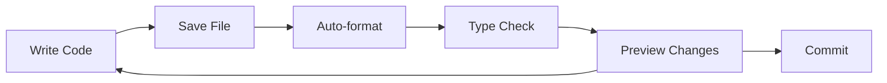

# Development Workflow

This guide covers day-to-day development practices for working in this codebase.

## Development Cycle



## Starting Development

### 1. Pull Latest Changes

```bash
git pull origin main
pnpm install  # In case dependencies changed
```

### 2. Start Dev Server

```bash
pnpm dev
```

This starts:

- Next.js dev server at `http://localhost:3000`
- Turbopack for fast refresh
- File watching for all packages

### 3. Environment Variables

The app uses type-safe environment variables validated with `@t3-oss/env`. If you encounter validation errors:

```bash
❌ Invalid environment variables: {
  POSTGRES_URL: [ 'Invalid input: expected string, received undefined' ]
}
```

Check that your `.env` file exists and contains all required variables. See `.env.example` for documentation.

### 4. Make Changes

Edit files in your editor. Changes in `packages/ui` automatically reflect in `apps/web` due to hot module replacement.

## Code Quality

### Automatic Formatting

Files are formatted automatically on save if using VS Code with Biome extension. Otherwise, run:

```bash
pnpm lint:fix
```

### Checking for Issues

```bash
# Check formatting and linting
pnpm lint:check

# Check TypeScript types
pnpm --filter web typecheck
```

### Pre-commit Hooks

Husky runs checks before each commit:

- Biome formatting validation
- Linting rules check

If a commit fails, fix the issues and try again.

## Working with Packages

### Making Changes to UI Package

When editing `packages/ui`:

1. Changes hot-reload in `apps/web`
2. Export new components from `package.json` if needed
3. Test in the web app before committing

### Adding Dependencies

```bash
# Add to a specific package
pnpm add <package> --filter web
pnpm add <package> --filter @workspace/ui

# Add to root (dev tools only)
pnpm add -D <package> -w
```

### Running Commands in Specific Packages

```bash
# Run command in specific package
pnpm --filter web <command>
pnpm --filter @workspace/ui <command>

# Examples
pnpm --filter web build
pnpm --filter @workspace/ui typecheck
```

## Debugging

### React DevTools

Install the React DevTools browser extension for component inspection.

### Server-Side Debugging

For debugging Server Components:

1. Add `console.log` statements (remember to remove before committing)
2. Check terminal output where `pnpm dev` is running
3. Use VS Code debugger with Next.js debug configuration

### Client-Side Debugging

1. Use browser DevTools (Console, Sources, Network tabs)
2. Add `debugger` statements (remember to remove)
3. React DevTools for component state

## Building for Production

### Local Production Build

```bash
# Build all packages
pnpm build

# Start production server
pnpm --filter web start
```

### Checking Build Output

After building, verify:

1. No TypeScript errors
2. No console warnings about missing dependencies
3. Bundle size is reasonable

## Common Workflows

### Creating a New Component

1. Add component file to `packages/ui/src/components/`
2. Export from `packages/ui/package.json` if needed
3. Import in `apps/web` using `@workspace/ui/components/<name>`
4. Test in development

### Adding a New Page

1. Create file in `apps/web/app/<route>/page.tsx`
2. Add layout if needed (`layout.tsx`)
3. Test navigation and rendering

### Updating Styles

1. Modify `packages/ui/src/styles/globals.css` for global changes
2. Use Tailwind utilities in components for local changes
3. Add CSS variables for new design tokens

## Performance Tips

### Turbo Caching

Turbo caches build outputs. To benefit:

- Avoid modifying `node_modules`
- Keep package boundaries clean
- Use `pnpm build` (not direct Next.js commands) for caching

### Development Performance

- Use Turbopack (enabled by default)
- Close unused browser tabs
- Limit browser extensions in development

## Troubleshooting

### Hot Reload Not Working

1. Check terminal for errors
2. Hard refresh browser (Cmd+Shift+R)
3. Restart dev server

### Import Errors

1. Verify the export exists in the source package
2. Check `package.json` exports field
3. Run `pnpm install` to relink packages

### Slow Builds

1. Check for circular dependencies
2. Review import sizes (avoid importing entire libraries)
3. Clear Turbo cache: `rm -rf .turbo`
