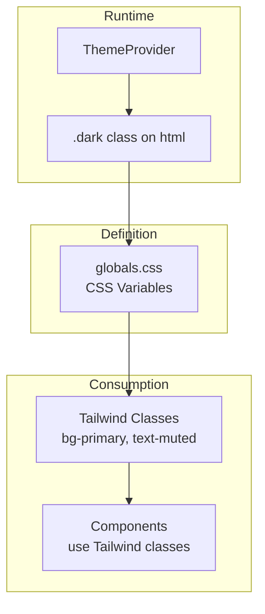

# Theming

This guide explains the theme system and how to customize it.

## Theme Architecture

The theme system uses:

1. **CSS Custom Properties** - Design tokens defined as CSS variables
2. **Tailwind CSS** - Utility classes that reference the tokens
3. **next-themes** - Runtime theme switching (light/dark mode)



## Color System

Colors are defined using **OKLch** (Oklch) color space, which provides perceptually uniform colors.

### Color Token Structure

Located in `packages/ui/src/styles/globals.css`:

```css
:root {
  /* Background and foreground */
  --background: oklch(1 0 0);           /* White */
  --foreground: oklch(0.145 0 0);       /* Near black */

  /* Component colors */
  --card: oklch(1 0 0);
  --card-foreground: oklch(0.145 0 0);

  /* Primary action color */
  --primary: oklch(0.205 0 0);
  --primary-foreground: oklch(0.985 0 0);

  /* Secondary action color */
  --secondary: oklch(0.97 0 0);
  --secondary-foreground: oklch(0.205 0 0);

  /* Muted/subtle elements */
  --muted: oklch(0.97 0 0);
  --muted-foreground: oklch(0.556 0 0);

  /* Accent highlights */
  --accent: oklch(0.97 0 0);
  --accent-foreground: oklch(0.205 0 0);

  /* Destructive actions */
  --destructive: oklch(0.577 0.245 27.325);

  /* Borders and inputs */
  --border: oklch(0.922 0 0);
  --input: oklch(0.922 0 0);
  --ring: oklch(0.708 0 0);
}

.dark {
  --background: oklch(0.145 0 0);
  --foreground: oklch(0.985 0 0);
  /* ... dark mode overrides */
}
```

### Using Colors in Components

Reference colors using Tailwind classes:

```tsx
// Background colors
<div className="bg-background" />
<div className="bg-primary" />
<div className="bg-destructive" />

// Text colors
<p className="text-foreground" />
<p className="text-muted-foreground" />
<p className="text-primary-foreground" />

// Border colors
<div className="border-border" />
<input className="border-input" />
```

## Adding Custom Colors

### 1. Define the CSS Variable

Add to `globals.css`:

```css
:root {
  --brand: oklch(0.6 0.2 250);        /* Brand blue */
  --brand-foreground: oklch(1 0 0);    /* White text */
}

.dark {
  --brand: oklch(0.7 0.2 250);         /* Lighter in dark mode */
  --brand-foreground: oklch(0 0 0);
}
```

### 2. Extend Tailwind

Tailwind v4 automatically picks up CSS variables prefixed with `--`. You can use them as:

```tsx
<button className="bg-[--brand] text-[--brand-foreground]" />
```

Or add them to your Tailwind theme for cleaner syntax.

## Dark Mode

### How It Works

1. `next-themes` manages the current theme
2. It adds/removes the `.dark` class on `<html>`
3. CSS variables change based on `.dark` presence

### Theme Provider Setup

Located in `apps/web/components/providers.tsx`:

```tsx
"use client"

import { ThemeProvider } from "next-themes"

export function Providers({ children }: { children: React.ReactNode }) {
  return (
    <ThemeProvider attribute="class" defaultTheme="system" enableSystem>
      {children}
    </ThemeProvider>
  )
}
```

### Adding a Theme Toggle

```tsx
"use client"

import { useTheme } from "next-themes"
import { Button } from "@workspace/ui/components/button"

export function ThemeToggle() {
  const { theme, setTheme } = useTheme()

  return (
    <Button
      variant="outline"
      onClick={() => setTheme(theme === "dark" ? "light" : "dark")}
    >
      Toggle theme
    </Button>
  )
}
```

### Preventing Flash

The theme provider handles flash prevention, but ensure:

1. `defaultTheme="system"` respects OS preference
2. `enableSystem` listens for OS changes
3. `attribute="class"` uses class-based switching

## Spacing and Sizing

### Border Radius

```css
:root {
  --radius: 0.625rem;
}
```

Used as:

```tsx
<div className="rounded-lg" />  /* Uses --radius */
```

### Custom Spacing

Define additional spacing tokens if needed:

```css
:root {
  --spacing-page: 2rem;
  --spacing-section: 4rem;
}
```

## Typography

Typography scales can be defined as CSS variables:

```css
:root {
  --font-sans: ui-sans-serif, system-ui, sans-serif;
  --font-mono: ui-monospace, monospace;
}
```

## Component-Specific Tokens

Some components have their own tokens:

```css
:root {
  /* Sidebar specific */
  --sidebar: oklch(0.985 0 0);
  --sidebar-foreground: oklch(0.145 0 0);
  --sidebar-primary: oklch(0.205 0 0);
  --sidebar-accent: oklch(0.97 0 0);
  --sidebar-border: oklch(0.922 0 0);
  --sidebar-ring: oklch(0.708 0 0);
}
```

## Best Practices

### Semantic Naming

Use semantic names that describe purpose, not appearance:

```css
/* Good */
--destructive: oklch(0.577 0.245 27.325);

/* Avoid */
--red-500: oklch(0.577 0.245 27.325);
```

### Foreground Pairs

Always define both background and foreground:

```css
--primary: oklch(0.205 0 0);
--primary-foreground: oklch(0.985 0 0);
```

### Test Both Modes

Always verify colors work in both light and dark modes:

1. Check contrast ratios meet WCAG guidelines
2. Ensure readability in both modes
3. Test interactive states (hover, focus)

## Troubleshooting

### Colors Not Changing in Dark Mode

1. Verify `.dark` class is on `<html>`
2. Check the variable is defined in `.dark` block
3. Ensure ThemeProvider is wrapping the app

### Tailwind Not Recognizing Colors

1. Check CSS variable naming matches Tailwind expectations
2. Rebuild if using custom Tailwind config
3. Clear browser cache
